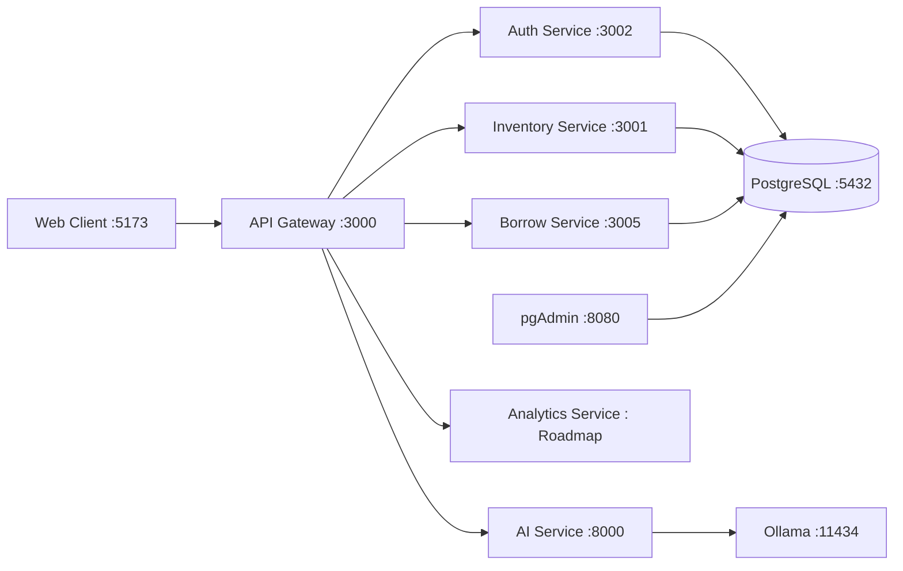

# SmartBook System

> Nền tảng quản lý kho và luân chuyển sách hiện đại, kết nối vận hành vật lý với nghiệp vụ lưu thông trên kiến trúc Microservices.


## Mục lục

- [Sứ mệnh và tầm nhìn](#sứ-mệnh-và-tầm-nhìn)
- [Kiến trúc cốt lõi](#kiến-trúc-cốt-lõi)
- [Sơ đồ luồng Microservices](#sơ-đồ-luồng-microservices)
- [Thiết kế dữ liệu](#thiết-kế-dữ-liệu)
- [Tích hợp AI](#tích-hợp-ai)
- [Business Domain và ma trận vai trò](#business-domain-và-ma-trận-vai-trò)
- [Service Catalog](#service-catalog)
- [Technical Stack](#technical-stack)
- [Deployment Flow](#deployment-flow)
- [Cấu trúc dự án](#cấu-trúc-dự-án)
- [Chiến lược dọn dẹp tài liệu](#chiến-lược-dọn-dẹp-tài-liệu)
- [Tài liệu chuyên sâu](#tài-liệu-chuyên-sâu)

## Sứ mệnh và tầm nhìn

SmartBook không chỉ là phần mềm thư viện. Đây là giải pháp điều phối toàn chuỗi nghiệp vụ từ kho vật lý đến lưu thông sách:

- 🏭 Tầng vận hành kho: barcode, vị trí kệ, nhập/xuất, kiểm kê.
- 🔁 Tầng lưu thông: mượn/trả, giữ chỗ, gia hạn, phí phạt.
- 🤖 Tầng hỗ trợ AI: nhận diện sách từ ảnh, trích xuất metadata, hỗ trợ nhập liệu tự động.
- 🔐 Tầng quản trị: IAM, RBAC/PBAC, phân tách quyền theo vai trò và phạm vi kho.

## Kiến trúc cốt lõi

### 1. Microservices orchestration qua API Gateway

- API Gateway là cổng vào duy nhất cho client tại cổng 3000.
- Gateway định tuyến theo domain:
  - /auth, /iam → Auth Service
  - /api, /catalog → Inventory Service
  - /borrow, /my → Borrow Service
  - /ai, /api/ai → AI Service
- Cấu trúc này giúp cô lập domain, giảm coupling và tối ưu khả năng scale từng service.

### 2. Domain tách biệt theo nghiệp vụ

- Auth: định danh, xác thực, phân quyền.
- Inventory: danh mục, tồn kho, kho bãi, nhập/xuất.
- Borrow: lưu thông, thành viên, phí phạt, thông báo.
- AI: OCR, nhận diện sách, enrichment metadata.
- Analytics: domain báo cáo và tổng hợp dữ liệu vận hành (đang hoàn thiện module thực thi).

### 3. Khả năng mở rộng theo service

- Mỗi service có vòng đời deploy độc lập.
- Mỗi service có DATABASE_URL tách riêng theo cơ sở dữ liệu nghiệp vụ.
- Hỗ trợ nâng cấp dần từng module mà không ảnh hưởng toàn hệ thống.

## Sơ đồ luồng Microservices



## Thiết kế dữ liệu

SmartBook sử dụng PostgreSQL với Prisma ORM theo mô hình đa domain dữ liệu:

- auth_db: người dùng, vai trò, quyền, quan hệ role-permission.
- inventory_db: catalog, biến thể, kho, vị trí, tồn kho, biến động.
- borrow_db: thành viên, mượn/trả, đặt chỗ, phí phạt, thông báo.

Thiết kế hiện tại ưu tiên tách cơ sở dữ liệu theo service để giảm xung đột migration và dễ kiểm soát ownership dữ liệu. Prisma được dùng làm lớp truy cập dữ liệu chuẩn hóa cho các service Node.js.

## Tích hợp AI

AI Service được xây dựng bằng FastAPI và tích hợp Local LLM qua Ollama:

- OCR và nhận diện thông tin sách từ ảnh bìa.
- Lookup metadata theo ISBN (kết hợp nhiều nguồn).
- Tạo tóm tắt tiếng Việt hỗ trợ quy trình nhập liệu.
- Chế độ chạy local giúp kiểm soát dữ liệu nội bộ và giảm phụ thuộc dịch vụ ngoài.

## Business Domain và ma trận vai trò

Trong SmartBook, phân tách Librarian và Warehouse Staff là nguyên tắc bắt buộc:

- Librarian tập trung lưu thông và trải nghiệm bạn đọc.
- Warehouse Staff tập trung vận hành vật lý kho.

| Vai trò | Trọng tâm nghiệp vụ | Quyền nghiệp vụ chính | Hệ thống liên quan |
|---|---|---|---|
| Customer | Tự phục vụ qua cổng khách hàng | Mượn, trả, đặt chỗ, thanh toán phí phạt, theo dõi tài khoản cá nhân | Borrow Portal |
| Librarian | Lưu thông và hỗ trợ bạn đọc | Duyệt mượn/trả, xử lý gia hạn, giữ chỗ, xử lý vi phạm lưu thông | Borrow Service |
| Warehouse Staff | Vận hành kho vật lý | Quản lý barcode, vị trí kệ, nhập/xuất, điều chuyển, kiểm kê | Inventory Service |
| Manager | Quản trị vận hành cấp trung | Phê duyệt chênh lệch kiểm kê, quản lý nhà cung cấp, theo dõi KPI | Inventory + Analytics |
| Admin | Quản trị nền tảng | Quản lý user/role/policy, RBAC/PBAC, cấu hình hệ thống | Auth + IAM |

## Service Catalog

| Service | Cổng | Vai trò | Endpoint trọng yếu |
|---|---:|---|---|
| API Gateway | 3000 | Cổng vào tập trung và định tuyến domain | /health, /auth, /iam, /api, /borrow, /ai |
| Auth Service | 3004 → 3002 | IAM, xác thực, token, phân quyền | /auth/login, /auth/me, /iam/users, /iam/roles |
| Inventory Service | 3003 → 3001 | Catalog, kho, tồn, nhập/xuất, supplier | /api/books, /api/warehouses, /api/goods-receipts |
| Borrow Service | 3005 | Mượn/trả, đặt chỗ, phí phạt, hồ sơ thành viên | /borrow/loans, /borrow/reservations, /borrow/fines, /borrow/my |
| AI Service | 8000 | OCR, metadata enrichment, summary | /health, /recognize-book, /lookup-book-by-isbn |
| Analytics Service | Roadmap | Báo cáo và phân tích vận hành đa domain | Đang chuẩn hóa module |
| Web UI | 5173 | Giao diện quản trị và cổng nghiệp vụ | Dashboard, Catalog, Borrow, IAM |
| PostgreSQL | 5432 | Lưu trữ dữ liệu giao dịch | auth_db, inventory_db, borrow_db |
| pgAdmin | 8080 | Quản trị dữ liệu | UI quản trị DB |
| Ollama | 11434 | Local LLM runtime cho AI | inference nội bộ |

## Technical Stack

### 🧩 Backend

- Node.js + Express cho API Gateway, Auth, Inventory, Borrow.
- FastAPI cho AI Service.
- Prisma ORM cho các service Node.js sử dụng PostgreSQL.

### 🎨 Frontend

- React + Vite + TypeScript.
- Routing và API client tách lớp để dễ mở rộng theo domain.

### ⚙️ DevOps và vận hành

- Docker Compose cho local orchestration.
- pgAdmin cho quản trị dữ liệu.
- Ollama cho local model serving.

## Deployment Flow

### Bước 1: Chuẩn bị môi trường

```bash
git clone https://github.com/your-org/smartbook-system.git
cd smartbook-system
copy .env.example .env
```

Biến quan trọng cần rà soát trong .env:

- DB_USER, DB_PASSWORD, DB_HOST, DB_PORT.
- AUTH_DB_NAME, INVENTORY_DB_NAME, BORROW_DB_NAME.
- JWT_SECRET, INTERNAL_SERVICE_KEY.
- VITE_API_BASE_URL, VITE_AUTH_BASE_URL, VITE_AI_BASE_URL.
- OLLAMA_HOST, SUMMARY_MODEL.

### Bước 2: Khởi chạy nhanh toàn stack

```cmd
scripts\run-all.bat
```

### Bước 3: Hoặc khởi chạy thủ công bằng Docker Compose

```bash
docker compose up -d --build
docker compose --profile dev run --rm auth-db-push
docker compose --profile dev run --rm inventory-db-push
docker compose --profile dev run --rm borrow-db-push
docker compose ps
```

### Bước 4: Kiểm tra sau triển khai

| Thành phần | URL |
|---|---|
| Web UI | http://localhost:5173 |
| API Gateway | http://localhost:3000 |
| AI Service | http://localhost:8000 |
| pgAdmin | http://localhost:8080 |
| Ollama | http://localhost:11434 |

## Cấu trúc dự án

```text
smartbook-system/
|- apps/
|  |- api-gateway/
|  \- web/
|- services/
|  |- auth-service/
|  |- inventory-service/
|  |- borrow-service/
|  |- ai-service/
|  \- analytics-service/
|- packages/
|  \- shared/
|- db-init/
|- docs/
|  |- SERVICES/
|  \- TEST_GUIDES/
|- scripts/
|- docker-compose.yml
\- README.md
```

## Chiến lược dọn dẹp tài liệu

- Xóa các README boilerplate mặc định không mang giá trị nghiệp vụ.
- Mọi giới thiệu hệ thống tập trung tại README root.
- README trong từng service chỉ giữ thông tin đặc thù:
  - Biến môi trường riêng.
  - Endpoint quan trọng.
  - Lệnh chạy local ngắn gọn.
- Tài liệu chuyên sâu được tách theo domain trong docs/SERVICES.

## Tài liệu chuyên sâu

- Kiến trúc tổng quan: docs/PROJECT_OVERVIEW.md
- Hướng dẫn chạy Docker chi tiết: docs/RUN_WITH_DOCKER.md
- Domain AI: docs/SERVICES/AI_SERVICE.md
- Domain Inventory: docs/SERVICES/INVENTORY_SERVICE.md
- Domain Auth: docs/SERVICES/AUTH_SERVICE.md
- Domain Borrow: docs/SERVICES/BORROW_SERVICE.md
- Domain Analytics: docs/SERVICES/ANALYTICS_SERVICE.md
- Test guide theo phase: docs/TEST_GUIDES/

## Góp ý và đóng góp

Nếu bạn là contributor mới, nên đi theo luồng đọc tài liệu sau:

1. README root để nắm kiến trúc tổng quan.
2. docs/RUN_WITH_DOCKER.md để dựng môi trường.
3. docs/SERVICES tương ứng domain bạn phụ trách.
