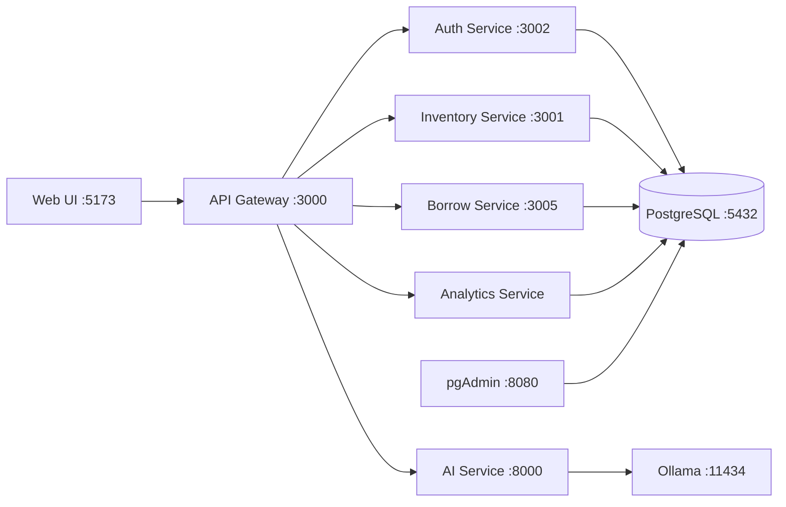
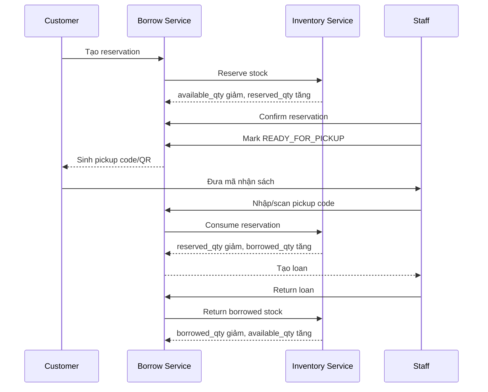

# SmartBook System

SmartBook System là đồ án xây dựng một nền tảng quản lý thư viện hiện đại theo kiến trúc microservices. Hệ thống không chỉ quản lý danh mục sách, mà còn mô phỏng đầy đủ chuỗi vận hành thư viện: quản trị người dùng, nhập kho, quản lý tồn, đặt sách, mượn sách, trả sách, phí phạt, customer portal và hỗ trợ AI cho nhập liệu sách.

Mục tiêu của project là chứng minh một hệ thống thư viện có thể được thiết kế như một sản phẩm vận hành thật: dữ liệu được tách theo domain, các service giao tiếp qua API, tồn kho được cập nhật theo nghiệp vụ, và các flow chính có thể demo/test end-to-end bằng Docker.

## Mục Lục

- [Bài toán](#bài-toán)
- [Phạm vi hệ thống](#phạm-vi-hệ-thống)
- [Kiến trúc tổng quan](#kiến-trúc-tổng-quan)
- [Các domain nghiệp vụ](#các-domain-nghiệp-vụ)
- [Luồng nghiệp vụ chính](#luồng-nghiệp-vụ-chính)
- [Service catalog](#service-catalog)
- [Công nghệ sử dụng](#công-nghệ-sử-dụng)
- [Chạy project bằng Docker](#chạy-project-bằng-docker)
- [Tài khoản demo](#tài-khoản-demo)
- [Kiểm thử](#kiểm-thử)
- [Cấu trúc thư mục](#cấu-trúc-thư-mục)
- [Tài liệu tham khảo](#tài-liệu-tham-khảo)

## Bài Toán

Một thư viện thực tế không chỉ cần lưu danh sách sách. Hệ thống phải quản lý được:

- Sách có nhiều biến thể, ISBN, barcode, trạng thái mượn được hay không.
- Kho, vị trí kệ, tồn khả dụng, tồn đã giữ chỗ, tồn đang được mượn.
- Khách hàng có membership, giới hạn số sách được mượn/đặt.
- Reservation cần giữ tồn kho thật, có hạn nhận sách và có thể hết hạn.
- Staff cần xác nhận đặt sách, phát sách tại quầy, xử lý mượn/trả.
- Khi quá hạn, mất hoặc hư sách, hệ thống phải sinh phí phạt.
- Admin cần quản trị user, role, permission.
- Nhân viên cần công cụ nhập liệu nhanh, có thể dùng OCR/AI để lấy metadata sách.

SmartBook giải bài toán này bằng cách chia hệ thống thành các domain service độc lập, mỗi service sở hữu dữ liệu và nghiệp vụ riêng.

## Phạm Vi Hệ Thống

Các chức năng chính đã có trong project:

- Auth/IAM: đăng nhập, JWT, user, role, permission, phân quyền theo API.
- Inventory: catalog sách, variants, warehouse, location, stock balance, stock movement, goods receipt, outbound/picking.
- Borrow: customer, membership, reservation, loan, return, renewal, fine, notification, wallet/account ledger.
- Customer Portal: customer xem catalog, đặt sách, xem reservation, mã pickup/QR, loan, fine, wishlist, review, notification.
- AI Service: nhận diện/tra cứu thông tin sách, hỗ trợ OCR và metadata enrichment.
- Analytics Service: module nền cho báo cáo/tổng hợp vận hành.
- Web UI: giao diện quản trị và customer portal trên React/Vite.
- Docker Compose: dựng toàn bộ stack local gồm database, services, gateway, web, pgAdmin, Ollama.

## Kiến Trúc Tổng Quan


```mermaid
flowchart LR
    UI["Web UI :5173"] --> GW["API Gateway :3000"]

    GW --> AUTH["Auth Service :3002"]
    GW --> INV["Inventory Service :3001"]
    GW --> BORROW["Borrow Service :3005"]
    GW --> AI["AI Service :8000"]
    GW --> ANA["Analytics Service"]

    AUTH --> PG[("PostgreSQL :5432")]
    INV --> PG
    BORROW --> PG
    ANA --> PG

    AI --> OLLAMA["Ollama :11434"]
    PGADMIN["pgAdmin :8080"] --> PG
```

API Gateway là cổng vào tập trung cho frontend:

- `/auth`, `/iam` -> Auth Service.
- `/api`, `/catalog` -> Inventory Service.
- `/borrow`, `/my` -> Borrow Service.
- `/analytics` -> Analytics Service.
- `/ai`, `/api/ai` -> AI Service.

Các service Node.js dùng Prisma ORM và PostgreSQL. Database được tách theo domain để giảm coupling:

- `auth_db`: người dùng, role, permission, session/auth metadata.
- `inventory_db`: catalog, variants, warehouse, location, stock balances, stock movements.
- `borrow_db`: customers, memberships, reservations, loans, fines, notifications, wallet/account ledger.

## Các Domain Nghiệp Vụ

### Auth / IAM

Auth Service quản lý định danh và phân quyền:

- Đăng nhập bằng username/email.
- Sinh JWT dùng chung qua API Gateway.
- Quản lý user, role, permission.
- Hỗ trợ superuser và permission-based authorization cho các service.

### Inventory

Inventory Service quản lý kho vật lý và catalog:

- Books, book variants, ISBN, barcode, metadata.
- Warehouses, warehouse locations.
- Stock balances theo variant/location.
- Goods receipts, outbound, picking, stock movements.
- API tích hợp cho Borrow Service giữ tồn, consume tồn khi mượn và trả tồn khi hoàn sách.

### Borrow

Borrow Service là domain lưu thông sách:

- Customer profile, membership plan, active membership.
- Reservation lifecycle: `PENDING`, `CONFIRMED`, `READY_FOR_PICKUP`, `CONVERTED_TO_LOAN`, `CANCELLED`, `EXPIRED`.
- Loan lifecycle: mượn, gia hạn, trả, quá hạn, mất, hư.
- Fine lifecycle: sinh fine, thanh toán, waive/reduce.
- Notification và audit log cho các nghiệp vụ quan trọng.
- Account/wallet ledger cho phí mượn/phí phạt.

### Customer Portal

Customer Portal là phần trải nghiệm khách hàng:

- Xem catalog và chi tiết sách.
- Đặt sách.
- Theo dõi reservation và hạn nhận sách.
- Xem pickup code/QR khi sách sẵn sàng nhận.
- Xem loan, yêu cầu gia hạn, xem fine, thanh toán fine.
- Wishlist, review, notification, preference.

### AI

AI Service hỗ trợ tự động hóa nhập liệu:

- OCR/recognition từ ảnh bìa hoặc ảnh sách.
- Lookup metadata theo ISBN.
- Gợi ý mô tả/tóm tắt.
- Chạy local qua Ollama để phù hợp môi trường demo và kiểm soát dữ liệu.

### Analytics

Analytics Service là module dành cho báo cáo vận hành:

- Tổng hợp KPI thật từ `inventory_db` và `borrow_db`.
- Phục vụ dashboard staff/manager/admin qua API Gateway prefix `/analytics`.
- Là nơi duy nhất gom dữ liệu chéo domain cho báo cáo; các service nghiệp vụ không query chéo database.
- Không dùng fake data hoặc số liệu hardcode ở frontend.

Các endpoint chính:

| Method | Endpoint | Ý nghĩa |
|---|---|---|
| GET | `/analytics/dashboard/kpis` | KPI tổng quan: đầu sách, bản sao, loan, reservation, pickup code, fine, low stock |
| GET | `/analytics/borrow-trends` | Xu hướng mượn/trả/đặt sách theo ngày hoặc tháng |
| GET | `/analytics/top-books` | Sách được mượn nhiều nhất |
| GET | `/analytics/overdue-summary` | Tổng hợp loan/item quá hạn |
| GET | `/analytics/fine-summary` | Tổng hợp fine đã thu, chưa thu, waived và theo loại |
| GET | `/analytics/warehouse-stock-risk` | Rủi ro tồn kho thấp/hết hàng theo warehouse |
| GET | `/analytics/reorder-suggestions` | AI demand forecasting và gợi ý nhập thêm sách từ lượt mượn, reservation, wishlist, cảnh báo chờ hàng và tồn kho |
| GET | `/analytics/reservation-funnel` | Funnel reservation và tỷ lệ convert sang loan |

Ví dụ response rút gọn:

```json
{
  "data": {
    "total_titles": 120,
    "total_copies": 850,
    "active_loans": 42,
    "overdue_loans": 7,
    "unpaid_fine_amount": 350000,
    "reservation_conversion_rate": 68.5
  }
}
```

Endpoint `/analytics/reorder-suggestions` nhận các query phổ biến như `days=30`, `limit=20`, `leadTimeDays=14`, `priority=HIGH|MEDIUM|LOW|ALL`. Response gồm summary tổng số candidate, số lượng HIGH/MEDIUM/LOW, tổng số lượng đề xuất nhập thêm và danh sách sách với `forecast_7d`, `forecast_30d`, `estimated_days_until_stockout`, `priority`, `suggested_reorder_qty`, `reason`.

## Luồng Nghiệp Vụ Chính

### 1. Đặt sách -> mượn sách -> trả sách

Đây là flow demo quan trọng nhất của project:


```mermaid
sequenceDiagram
    participant C as Customer
    participant B as Borrow Service
    participant I as Inventory Service
    participant S as Staff

    C->>B: Tạo reservation
    B->>I: Reserve stock
    I-->>B: available_qty giảm, reserved_qty tăng
    S->>B: Confirm reservation
    S->>B: Mark READY_FOR_PICKUP
    B-->>C: Sinh pickup code/QR
    C->>S: Đưa mã nhận sách
    S->>B: Nhập/scan pickup code
    B->>I: Consume reservation
    I-->>B: reserved_qty giảm, borrowed_qty tăng
    B-->>S: Tạo loan
    S->>B: Return loan
    B->>I: Return borrowed stock
    I-->>B: borrowed_qty giảm, available_qty tăng
```

Các điểm nghiệp vụ đã xử lý:

- Customer đặt sách thì hệ thống giữ tồn kho thật.
- Staff xác nhận reservation trước khi phát sách.
- Khi `READY_FOR_PICKUP`, hệ thống tạo pickup code.
- Staff nhập mã hoặc scan QR để convert reservation thành loan.
- Khi mượn, tồn kho chuyển từ `reserved_qty` sang `borrowed_qty`.
- Khi trả, tồn kho được phục hồi về `available_qty`.
- Quá hạn, mất hoặc hư sách sẽ sinh fine.
- Reservation hết hạn được job tự động release stock.

### 2. Pickup code / QR code

Pickup code giúp staff phát đúng sách cho đúng reservation:

- Mã có dạng `PU-XXXX-XXXX`.
- QR payload có dạng `SMARTBOOK:PICKUP:PU-XXXX-XXXX`.
- Customer nhìn thấy mã trong My Reservations.
- Staff dùng ô Pickup Counter để nhập mã hoặc mở modal scan QR.
- Reservation `READY_FOR_PICKUP` không được convert trực tiếp bằng id; bắt buộc dùng pickup code.
- Sau khi convert thành loan, hệ thống lưu `pickup_code_used_at`.

Endpoint chính:

```http
POST /borrow/reservations/pickup/convert-to-loan
Content-Type: application/json

{
  "pickup_code": "SMARTBOOK:PICKUP:PU-XXXX-XXXX"
}
```

### 3. Fine và xử lý vi phạm

Borrow Service tự tạo fine cho các trường hợp:

- `OVERDUE`: sách quá hạn.
- `LOST`: sách bị mất.
- `DAMAGE`: sách bị hư/hỏng.

Fine có thể được thanh toán, thanh toán một phần hoặc waive/reduce.

## Service Catalog

| Service | Cổng local | Vai trò | Endpoint tiêu biểu |
|---|---:|---|---|
| Web UI | 5173 | Giao diện admin/staff/customer | Dashboard, Catalog, Borrow, IAM, Customer Portal |
| API Gateway | 3000 | Cổng vào tập trung | `/health`, `/auth`, `/iam`, `/api`, `/borrow`, `/analytics`, `/ai` |
| Auth Service | 3004 -> 3002 | Xác thực và phân quyền | `/auth/login`, `/auth/me`, `/iam/users`, `/iam/roles` |
| Inventory Service | 3003 -> 3001 | Catalog và tồn kho | `/api/books`, `/api/warehouses`, `/api/borrow-integration/*` |
| Borrow Service | 3005 | Lưu thông sách | `/borrow/reservations`, `/borrow/loans`, `/borrow/fines`, `/my/*` |
| AI Service | 8000 | OCR/metadata enrichment | `/health`, `/recognize-book`, `/lookup-book-by-isbn` |
| Analytics Service | 3006 | Báo cáo/KPI từ dữ liệu thật | `/analytics/dashboard/kpis`, `/analytics/borrow-trends`, `/analytics/top-books` |
| PostgreSQL | 5432 | Lưu dữ liệu | `auth_db`, `inventory_db`, `borrow_db` |
| pgAdmin | 8080 | Quản trị database | Web UI |
| Ollama | 11434 | Local LLM runtime | inference nội bộ |

## Công Nghệ Sử Dụng

Backend:

- Node.js, Express.
- Prisma ORM.
- PostgreSQL.
- JWT, permission middleware.

Frontend:

- React.
- Vite.
- TypeScript.
- Tailwind-style utility classes.
- `qrcode` để render QR thật.
- `html5-qrcode` để scan camera/manual input.

AI:

- FastAPI.
- Ollama.
- OCR/metadata lookup.

DevOps:

- Docker Compose.
- pgAdmin.
- Seed data theo từng service.

## Chạy Project Bằng Docker

### 1. Chuẩn bị env

```powershell
copy .env.example .env
```

Các biến quan trọng:

- `DB_USER`, `DB_PASSWORD`, `DB_HOST`, `DB_PORT`
- `AUTH_DB_NAME`, `INVENTORY_DB_NAME`, `BORROW_DB_NAME`
- `JWT_SECRET`, `INTERNAL_SERVICE_KEY`
- `ANALYTICS_SERVICE_URL`, `LOW_STOCK_THRESHOLD`
- `VITE_API_BASE_URL`, `VITE_AUTH_BASE_URL`, `VITE_AI_BASE_URL`
- `OLLAMA_HOST`, `SUMMARY_MODEL`

### 2. Chạy toàn bộ stack

```powershell
docker compose up -d --build
docker compose ps
```

Khi chỉ cần rebuild các service vừa chỉnh:

```powershell
docker compose build borrow-service analytics-service api-gateway smartbook-ui
docker compose up -d borrow-service analytics-service api-gateway smartbook-ui
```

Các service tự chạy `prisma db push` và seed khi container khởi động theo `docker-compose.yml`.

### 3. URL local

| Thành phần | URL |
|---|---|
| Web UI | http://localhost:5173 |
| API Gateway | http://localhost:3000 |
| Borrow Service | http://localhost:3005 |
| Inventory Service | http://localhost:3003 |
| Auth Service | http://localhost:3004 |
| Analytics Service | http://localhost:3006 |
| AI Service | http://localhost:8000 |
| pgAdmin | http://localhost:8080 |
| Ollama | http://localhost:11434 |

## Tài Khoản Demo

Seed Auth Service tạo các user demo với mật khẩu chung:

```text
123456
```

Một số tài khoản thường dùng:

| Username | Vai trò |
|---|---|
| `hung` | Admin / superuser |
| `manager01` | Manager |
| `staff01` | Staff |
| `staff02` | Staff |
| `staff03` | Staff |
| `warehouse01` | Warehouse staff |
| `cs01` | Customer support |

## Kiểm Thử

### Purchase Order -> Supplier Fulfillment -> Goods Receipt

Flow nhap hang moi:

```text
PO DRAFT
-> submit
-> manager approve
-> send to supplier
-> supplier confirm + invoice/delivery note
-> warehouse staff creates Goods Receipt draft from invoice
-> staff posts Goods Receipt
-> stock increases
```

Quy tac nghiep vu:

- Approving a Purchase Order does not create stock or goods receipt.
- Stock increases only when Goods Receipt is POSTED.
- Goods Receipt for a PO must come from a supplier invoice/delivery note.
- Over-receiving is blocked by backend validation.
- Shortage is recorded as a supplier shortage report.

Docker integration test:

```powershell
node scripts\purchase-supplier-receiving-integration.mjs
```

Expected summary:

```text
PASS=13 TOTAL=13
```

### Supplier Portal / Shortage Redelivery

Supplier Portal supports two vendor entry points:

- Authenticated supplier account: supplier signs in at `/login` and is routed to `/supplier`.
- Public token fallback: staff can still open `/supplier/portal/:token` from a PO dispatch link.

Demo supplier accounts use the same default password:

```text
supplier-sv / 123456
supplier-phuongnam / 123456
supplier-ibd / 123456
```

Authenticated supplier access is scoped by matching the login email to the
inventory supplier email. Supplier accounts have only `supplier.portal.*`
permissions and cannot access stock receiving endpoints.

```text
Manager approves PO
-> Purchase staff sends to supplier
-> Supplier confirms
-> Supplier submits invoice / delivery note
-> Warehouse staff creates Goods Receipt draft from invoice
-> Staff posts Goods Receipt
-> Shortage report if counted quantity is short
-> Supplier acknowledges shortage
-> Supplier submits redelivery invoice
-> Staff receives redelivery and resolves shortage
```

Business rules:

- Supplier can confirm orders and submit invoice, delivery note, or redelivery note only.
- Supplier cannot create Goods Receipts, post Goods Receipts, mutate stock, or edit stock.
- Stock increases only when a Goods Receipt is `POSTED`; `DRAFT` receipts do not affect stock.
- Supplier invoice quantity cannot exceed Purchase Order remaining quantity.
- Redelivery quantity cannot exceed the linked shortage report quantity or PO remaining quantity.
- Staff receiving from supplier invoice cannot receive more than the invoice quantity or PO remaining quantity.
- Shortage reports are visible to staff and supplier, can be sent to supplier, acknowledged, redelivered, and resolved.

Frontend entry points:

```text
/supplier
/supplier/portal/:token
/supplier-deliveries
/supplier-deliveries/:id
/purchase-orders/:id
```

Docker integration test:

```powershell
node scripts\supplier-portal-integration.mjs
```

Expected summary:

```text
PASS=22 TOTAL=22
```

### Analytics dashboard integration

Script này đăng nhập bằng tài khoản staff demo, gọi đủ 7 endpoint `/analytics` qua API Gateway, kiểm tra response có field `data`, kiểm tra kiểu dữ liệu cơ bản và xác nhận customer token bị chặn 403:

```powershell
node scripts\analytics-integration.mjs
```

Kết quả mong đợi:

```text
PASS analytics/dashboard/kpis
PASS analytics/borrow-trends
PASS analytics/top-books
PASS analytics/overdue-summary
PASS analytics/fine-summary
PASS analytics/warehouse-stock-risk
PASS analytics/reservation-funnel
PASS analytics/customer-denied
PASS=7 TOTAL=7
ACCESS=1 TOTAL=1
```

### Borrow phase 2 integration

Script này kiểm tra flow borrow/fine chính qua API Gateway:

```powershell
$env:TEST_VARIANT_ID='36c746bb-6c0f-459e-b5e6-62759ca94de7'
$env:TEST_WAREHOUSE_ID='bae473df-be73-4e30-9348-5557217638ef'
node scripts\borrow-phase2-integration.mjs
```

Kết quả gần nhất:

```text
PASS=15 TOTAL=15
```

### Pickup code / QR flow

Flow pickup code đã được test end-to-end trên Docker:

- UI container response: pass.
- Customer tạo reservation: pass.
- Inventory chuyển `available_qty -> reserved_qty`: pass.
- Staff confirm và mark `READY_FOR_PICKUP`: pass.
- Hệ thống sinh pickup code: pass.
- Customer nhìn thấy pickup code: pass.
- Convert không có code bị chặn: pass.
- Convert bằng QR payload thành loan: pass.
- Inventory chuyển `reserved_qty -> borrowed_qty`: pass.
- Return loan phục hồi tồn kho: pass.

Kết quả gần nhất:

```text
Pickup code docker test: 19/19 passed
```

## Cấu Trúc Thư Mục

```text
smartbook-system/
|- apps/
|  |- api-gateway/
|  \- web/
|- services/
|  |- auth-service/
|  |- inventory-service/
|  |- borrow-service/
|  |- ai-service/
|  \- analytics-service/
|- packages/
|  \- shared/
|- db-init/
|- docs/
|  |- ARCHITECTURE/
|  |- SERVICES/
|  |- ANALYSIS/
|  \- TEST_GUIDES/
|- scripts/
|- docker-compose.yml
\- README.md
```

## Tài Liệu Tham Khảo

- Tổng quan kiến trúc: `docs/ARCHITECTURE/PROJECT_OVERVIEW.md`
- Hướng dẫn Docker: `docs/RUN_WITH_DOCKER.md`
- Auth Service: `docs/SERVICES/AUTH_SERVICE.md`
- Inventory Service: `docs/SERVICES/INVENTORY_SERVICE.md`
- Borrow Service: `docs/SERVICES/BORROW_SERVICE.md`
- AI Service: `docs/SERVICES/AI_SERVICE.md`
- Analytics Dashboard: `scripts/analytics-integration.mjs`, `/analytics/*`
- Test guides: `docs/TEST_GUIDES/`

## Ghi Chú Phát Triển

- Mỗi service nên sở hữu dữ liệu của domain mình, hạn chế truy vấn chéo database trực tiếp trong business code.
- Các flow ảnh hưởng tồn kho phải đi qua API tích hợp giữa Borrow Service và Inventory Service.
- Các thao tác tạo/cancel/convert/return nên dùng `Idempotency-Key` để tránh double-processing.
- Reservation `READY_FOR_PICKUP` phải được convert bằng pickup code hoặc QR payload.
- Khi debug tồn kho, kiểm tra bảng `stock_balances` trong `inventory_db` với ba trường chính: `available_qty`, `reserved_qty`, `borrowed_qty`.
