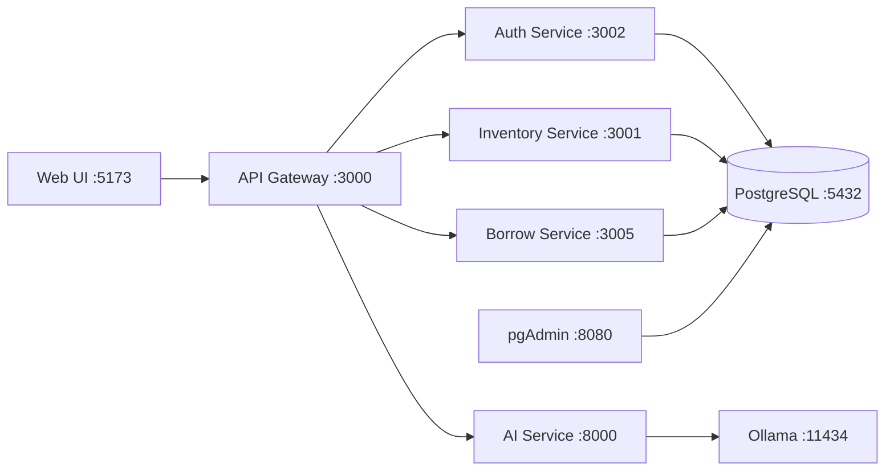

# SmartBook System

SmartBook là hệ thống quản lý thư viện và kho sách theo kiến trúc microservices. Dự án kết nối ba lớp nghiệp vụ chính: quản trị người dùng, vận hành tồn kho vật lý và lưu thông sách giữa khách hàng với thư viện.

## Mục Lục

- [Tổng quan](#tổng-quan)
- [Kiến trúc](#kiến-trúc)
- [Luồng demo chính](#luồng-demo-chính)
- [Service catalog](#service-catalog)
- [Technical stack](#technical-stack)
- [Chạy bằng Docker](#chạy-bằng-docker)
- [Tài khoản demo](#tài-khoản-demo)
- [Kiểm thử](#kiểm-thử)
- [Cấu trúc dự án](#cấu-trúc-dự-án)
- [Tài liệu liên quan](#tài-liệu-liên-quan)

## Tổng Quan

SmartBook tập trung vào các nghiệp vụ thư viện có trạng thái tồn kho thật:

- Quản lý catalog sách, biến thể sách, barcode, kho, vị trí kệ và tồn kho.
- Customer đặt sách, theo dõi reservation, nhận mã pickup/QR và xem lịch sử mượn trả.
- Staff xác nhận reservation, phát sách tại quầy, xử lý trả sách, mất/hư sách và phí phạt.
- Hệ thống tự cập nhật `available_qty`, `reserved_qty`, `borrowed_qty` giữa Borrow Service và Inventory Service.
- AI Service hỗ trợ OCR/metadata enrichment cho quá trình nhập liệu sách.
- Auth Service quản lý user, role, permission và JWT cho toàn bộ hệ thống.

## Kiến Trúc


```mermaid
flowchart LR
    UI["Web UI :5173"] --> GW["API Gateway :3000"]

    GW --> AUTH["Auth Service :3002"]
    GW --> INV["Inventory Service :3001"]
    GW --> BORROW["Borrow Service :3005"]
    GW --> AI["AI Service :8000"]

    AUTH --> PG[("PostgreSQL :5432")]
    INV --> PG
    BORROW --> PG
    AI --> OLLAMA["Ollama :11434"]
    PGADMIN["pgAdmin :8080"] --> PG
```

Gateway là cổng vào duy nhất cho frontend:

- `/auth`, `/iam` chuyển tới Auth Service.
- `/api`, `/catalog` chuyển tới Inventory Service.
- `/borrow`, `/my` chuyển tới Borrow Service.
- `/ai`, `/api/ai` chuyển tới AI Service.

Mỗi service Node.js dùng Prisma và database riêng theo domain:

- `auth_db`: user, role, permission, session/auth metadata.
- `inventory_db`: book catalog, variants, warehouses, locations, stock balances, stock movements.
- `borrow_db`: customers, memberships, reservations, loans, fines, notifications, audit logs.

## Luồng Demo Chính

### 1. Đặt sách, mượn sách, trả sách

Đây là flow nghiệp vụ cốt lõi của project:

1. Customer tạo reservation từ catalog.
2. Borrow Service gọi Inventory Service để giữ tồn kho.
3. Inventory giảm `available_qty`, tăng `reserved_qty`.
4. Staff xác nhận reservation.
5. Staff chuyển reservation sang `READY_FOR_PICKUP`.
6. Customer đến quầy nhận sách.
7. Staff convert reservation thành loan.
8. Inventory giảm `reserved_qty`, tăng `borrowed_qty`.
9. Khi trả sách, Inventory giảm `borrowed_qty`, tăng lại `available_qty`.
10. Nếu sách quá hạn, mất hoặc hư, Borrow Service tự tạo fine tương ứng.
11. Nếu reservation hết hạn, job tự release stock và chuyển reservation sang `EXPIRED`.

### 2. Reservation pickup code / QR code

Flow nhận sách tại quầy đã được hoàn thiện:

1. Customer đặt sách.
2. Staff confirm reservation.
3. Khi staff chuyển sang `READY_FOR_PICKUP`, hệ thống sinh pickup code dạng `PU-XXXX-XXXX`.
4. Customer thấy pickup code và QR trong trang My Reservations.
5. Staff nhập pickup code hoặc scan QR ở màn Borrow Reservations.
6. Hệ thống kiểm tra code, trạng thái và hạn pickup.
7. Nếu hợp lệ, reservation được convert thành loan.
8. Pickup code được đánh dấu đã dùng bằng `pickup_code_used_at`.

QR payload có dạng:

```text
SMARTBOOK:PICKUP:PU-XXXX-XXXX
```

Endpoint chính:

```http
POST /borrow/reservations/pickup/convert-to-loan
Content-Type: application/json

{
  "pickup_code": "SMARTBOOK:PICKUP:PU-XXXX-XXXX"
}
```

### 3. Fine tự động

Borrow Service tự sinh fine trong các trường hợp:

- `OVERDUE`: loan item quá hạn.
- `LOST`: sách bị mất khi trả.
- `DAMAGE`: sách hư/hỏng khi trả.

Fine có thể được thanh toán một phần/toàn phần hoặc waive/reduce bởi staff có quyền.

## Service Catalog

| Service | Cổng local | Vai trò | Endpoint chính |
|---|---:|---|---|
| Web UI | 5173 | Giao diện quản trị và customer portal | Dashboard, Catalog, Borrow, IAM |
| API Gateway | 3000 | Cổng vào tập trung | `/health`, `/auth`, `/iam`, `/api`, `/borrow`, `/ai` |
| Auth Service | 3004 -> 3002 | Xác thực, IAM, RBAC/PBAC | `/auth/login`, `/auth/me`, `/iam/users`, `/iam/roles` |
| Inventory Service | 3003 -> 3001 | Catalog, kho, tồn, nhập/xuất | `/api/books`, `/api/warehouses`, `/api/borrow-integration/*` |
| Borrow Service | 3005 | Reservation, loan, return, fine, customer portal | `/borrow/reservations`, `/borrow/loans`, `/borrow/fines`, `/my/*` |
| AI Service | 8000 | OCR, metadata enrichment | `/health`, `/recognize-book`, `/lookup-book-by-isbn` |
| PostgreSQL | 5432 | Lưu dữ liệu giao dịch | `auth_db`, `inventory_db`, `borrow_db` |
| pgAdmin | 8080 | Quản trị PostgreSQL | Web UI |
| Ollama | 11434 | Local LLM runtime | AI inference nội bộ |

## Technical Stack

- Backend: Node.js, Express, Prisma, PostgreSQL.
- Frontend: React, Vite, TypeScript, Tailwind-style utility classes.
- AI: FastAPI, Ollama, OCR/metadata integrations.
- DevOps: Docker Compose, pgAdmin.
- QR/scan: `qrcode` để render QR thật, `html5-qrcode` để scan camera/manual input.

## Chạy Bằng Docker

### Chuẩn bị

```powershell
copy .env.example .env
```

Các biến môi trường cần chú ý:

- `DB_USER`, `DB_PASSWORD`, `DB_HOST`, `DB_PORT`
- `AUTH_DB_NAME`, `INVENTORY_DB_NAME`, `BORROW_DB_NAME`
- `JWT_SECRET`, `INTERNAL_SERVICE_KEY`
- `VITE_API_BASE_URL`, `VITE_AUTH_BASE_URL`, `VITE_AI_BASE_URL`
- `OLLAMA_HOST`, `SUMMARY_MODEL`

### Chạy toàn bộ stack

```powershell
docker compose up -d --build
docker compose ps
```

Khi cần rebuild riêng flow borrow/web sau khi chỉnh code:

```powershell
docker compose build borrow-service smartbook-ui
docker compose up -d borrow-service smartbook-ui
```

Các service tự chạy `prisma db push` và seed khi container khởi động theo cấu hình trong `docker-compose.yml`.

### URL sau khi chạy

| Thành phần | URL |
|---|---|
| Web UI | http://localhost:5173 |
| API Gateway | http://localhost:3000 |
| Borrow Service | http://localhost:3005 |
| Inventory Service | http://localhost:3003 |
| Auth Service | http://localhost:3004 |
| AI Service | http://localhost:8000 |
| pgAdmin | http://localhost:8080 |
| Ollama | http://localhost:11434 |

## Tài Khoản Demo

Seed Auth Service tạo các tài khoản demo dùng chung mật khẩu:

```text
Mật khẩu: 123456
```

Một số username thường dùng:

- `hung`: admin/superuser.
- `manager01`: manager.
- `staff01`, `staff02`, `staff03`: staff.
- `warehouse01`: warehouse staff.
- `cs01`: customer support.

## Kiểm Thử

### Borrow phase 2 integration

Script này kiểm tra các nghiệp vụ mượn/trả/fine chính qua Docker gateway:

```powershell
$env:TEST_VARIANT_ID='36c746bb-6c0f-459e-b5e6-62759ca94de7'
$env:TEST_WAREHOUSE_ID='bae473df-be73-4e30-9348-5557217638ef'
node scripts\borrow-phase2-integration.mjs
```

Kết quả gần nhất:

```text
PASS=15 TOTAL=15
```

### Pickup code / QR flow

Flow pickup code đã được test end-to-end trên Docker qua API Gateway và PostgreSQL:

- UI container response: pass.
- Customer tạo reservation: pass.
- Stock chuyển `available -> reserved`: pass.
- Staff confirm: pass.
- Staff mark `READY_FOR_PICKUP` và sinh pickup code: pass.
- Customer nhìn thấy pickup code: pass.
- Convert trực tiếp không có code bị chặn: pass.
- Convert bằng QR payload `SMARTBOOK:PICKUP:<code>`: pass.
- Stock chuyển `reserved -> borrowed`: pass.
- Reservation được đánh dấu `CONVERTED_TO_LOAN` và `pickup_code_used_at`: pass.
- Return loan và restore stock: pass.

Kết quả gần nhất:

```text
Pickup code docker test: 19/19 passed
```

## Cấu Trúc Dự Án

```text
smartbook-system/
|- apps/
|  |- api-gateway/
|  \- web/
|- services/
|  |- auth-service/
|  |- inventory-service/
|  |- borrow-service/
|  \- ai-service/
|- packages/
|  \- shared/
|- db-init/
|- docs/
|  |- ARCHITECTURE/
|  |- SERVICES/
|  \- TEST_GUIDES/
|- scripts/
|- docker-compose.yml
\- README.md
```

## Tài Liệu Liên Quan

- Kiến trúc tổng quan: `docs/ARCHITECTURE/PROJECT_OVERVIEW.md`
- Hướng dẫn Docker chi tiết: `docs/RUN_WITH_DOCKER.md`
- Auth Service: `docs/SERVICES/AUTH_SERVICE.md`
- Inventory Service: `docs/SERVICES/INVENTORY_SERVICE.md`
- Borrow Service: `docs/SERVICES/BORROW_SERVICE.md`
- AI Service: `docs/SERVICES/AI_SERVICE.md`
- Test guides: `docs/TEST_GUIDES/`

## Ghi Chú Phát Triển

- Không convert reservation `READY_FOR_PICKUP` trực tiếp bằng reservation id; staff phải nhập/scan pickup code.
- Endpoint convert bằng pickup code chấp nhận cả mã thô `PU-XXXX-XXXX` và QR payload `SMARTBOOK:PICKUP:PU-XXXX-XXXX`.
- QR được render bằng thư viện `qrcode`, modal scan dùng `html5-qrcode`.
- Khi test dữ liệu tồn kho, nên đọc trực tiếp bảng `stock_balances` trong `inventory_db` để xác nhận `available_qty`, `reserved_qty`, `borrowed_qty`.
