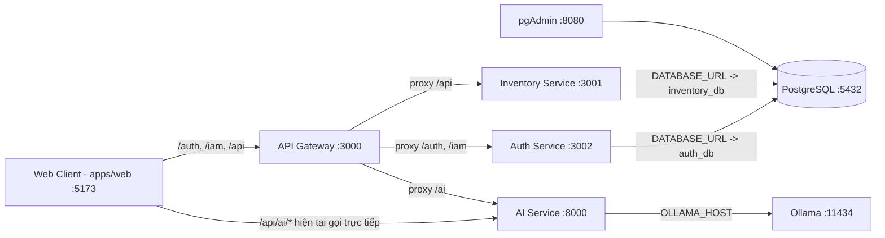

# Tổng quan dự án

SmartBook là hệ thống quản lý sách/kho sách theo kiến trúc microservices. Dự án tập trung vào các luồng nghiệp vụ chính: xác thực người dùng, quản lý danh mục sách và tồn kho, nhập kho, theo dõi biến động kho, và hỗ trợ AI/OCR cho nhận diện thông tin sách từ ảnh.

- Mục tiêu bài toán:
  - Quản lý dữ liệu sách, biến thể sách, kho, vị trí kho, phiếu nhập và tồn kho theo cấu trúc dịch vụ tách biệt.
  - Đồng bộ trải nghiệm web quản trị với API backend qua API Gateway.
  - Bổ sung AI service để xử lý nhận diện/summary sách từ ảnh bằng Ollama.
- Kiến trúc tổng thể (thực tế theo source/config hiện tại):
  - Client web React gọi API Gateway cho auth + inventory.
  - AI service được gọi trực tiếp từ web theo biến môi trường hiện tại.
  - Auth và Inventory dùng PostgreSQL (cùng 1 server DB, tách DB logic).
  - Ollama chạy riêng để phục vụ AI service.

## Kiến trúc hệ thống

Luồng request điển hình:

1. Người dùng đăng nhập từ web.
2. Web gọi endpoint auth (qua base URL cấu hình), nhận JWT.
3. JWT được đính kèm vào các request inventory/iam.
4. API Gateway chuyển tiếp request đến service đích (`/auth`, `/iam`, `/api`, `/ai`).
5. Auth/Inventory xử lý nghiệp vụ và truy cập PostgreSQL theo `DATABASE_URL`.
6. Với tác vụ AI, AI service gọi Ollama để sinh kết quả OCR/summary.

## Danh sách service

### 1) API Gateway

- Tên service: `api-gateway`
- Vai trò: cổng vào tập trung, reverse proxy cho Auth/Inventory/AI.
- Port: host `3000` -> container `3000`.
- Framework/ngôn ngữ: Node.js + Express + `http-proxy-middleware`.
- Phụ thuộc service: `auth-service`, `inventory-service`, `ai-service`.
- Dùng DB nào: không dùng DB trực tiếp.
- Biến môi trường quan trọng: `PORT`, `AUTH_SERVICE_URL`, `INVENTORY_SERVICE_URL`, `AI_SERVICE_URL`.
- Thư mục source chính: `apps/api-gateway/src`.

### 2) Auth Service

- Tên service: `auth-service`
- Vai trò: đăng ký/đăng nhập, phát JWT, IAM (users/roles/permissions).
- Port: host `3004` -> container `3002`.
- Framework/ngôn ngữ: Node.js + Express + Prisma + JWT.
- Phụ thuộc service: PostgreSQL (`db`).
- Dùng DB nào: `auth_db` (qua `DATABASE_URL`).
- Biến môi trường quan trọng: `PORT`, `DATABASE_URL`, `JWT_SECRET`, `JWT_EXPIRES_IN`.
- Thư mục source chính: `services/auth-service/src`.

### 3) Inventory Service

- Tên service: `inventory-service`
- Vai trò: quản lý sách, kho, vị trí, phiếu nhập, biến động kho.
- Port: host `3003` -> container `3001`.
- Framework/ngôn ngữ: Node.js + Express + Prisma + JWT middleware.
- Phụ thuộc service: PostgreSQL (`db`), JWT do auth phát hành.
- Dùng DB nào: `inventory_db` (qua `DATABASE_URL`).
- Biến môi trường quan trọng: `PORT`, `DATABASE_URL`, `JWT_SECRET`, `JSON_BODY_LIMIT`.
- Thư mục source chính: `services/inventory-service/src`.

### 4) AI Service

- Tên service: `ai-service`
- Vai trò: OCR/nhận diện thông tin sách từ ảnh, sinh mô tả sách.
- Port: host `8000` -> container `8000`.
- Framework/ngôn ngữ: Python + FastAPI + `ollama` SDK.
- Phụ thuộc service: `ollama`.
- Dùng DB nào: chưa thấy truy cập DB trong source hiện tại.
- Biến môi trường quan trọng: `OLLAMA_HOST`, `OLLAMA_MODEL`, `SUMMARY_MODEL`.
- Thư mục source chính: `services/ai-service` (entrypoint `main.py`).

### 5) Web UI

- Tên service: `smartbook-ui` (build từ `apps/web`).
- Vai trò: giao diện quản trị.
- Port: host `5173` -> container `5173`.
- Framework/ngôn ngữ: React + Vite + TypeScript.
- Phụ thuộc service: API Gateway/Auth/Inventory/AI qua biến `VITE_*`.
- Dùng DB nào: không dùng DB trực tiếp.
- Biến môi trường quan trọng: `VITE_API_BASE_URL`, `VITE_AUTH_BASE_URL`, `VITE_AI_BASE_URL`.
- Thư mục source chính: `apps/web/src`.

## API Gateway

- Gateway nằm ở: `apps/api-gateway/src/index.js`.
- Chức năng:
  - Health check (`GET /health`).
  - Proxy route:
    - `/auth` -> Auth service
    - `/iam` -> Auth service
    - `/api` -> Inventory service
    - `/ai` -> AI service (có `pathRewrite` bỏ tiền tố `/ai`)
- Auth/rate limit:
  - Không thấy middleware auth tại gateway.
  - Không thấy rate limit/circuit breaker/retry ở gateway hiện tại.
- Cách gọi backend:
  - Sử dụng `http-proxy-middleware`, target lấy từ biến môi trường.

## Database và hạ tầng dữ liệu

### PostgreSQL (`db`)

- Loại: PostgreSQL 15 (Docker image `postgres:15-alpine`).
- Service sử dụng: `auth-service`, `inventory-service`.
- Dữ liệu lưu:
  - `auth_db`: users, roles, permissions, user_roles, audit liên quan auth (theo query trong auth controller và seed SQL).
  - `inventory_db`: books, variants, warehouses, stock balances, goods receipts, stock movements...
- Migration/seed:
  - Không thấy thư mục migration Prisma (`prisma/migrations`) trong 2 service.
  - Có profile `inventory-db-push` và `auth-db-push` để `prisma db push`.
  - Có script init DB `db-init/00-full-schema.sql` (đã bao gồm extension).
  - Có file SQL tham khảo dữ liệu tại `data/smartbook_full_postgresql.sql` và `data/smartbook_merged_seed.sql`.
- Volume dữ liệu:
  - Docker volume `postgres_data:/var/lib/postgresql/data`.

### pgAdmin (`pgadmin`)

- Loại: công cụ quản trị PostgreSQL (không phải DB ứng dụng).
- Port: host `8080` -> container `80`.
- Dùng để: xem/kiểm tra dữ liệu PostgreSQL.

### Ollama (`ollama`)

- Loại: model serving runtime cho AI.
- Service sử dụng: `ai-service`.
- Dữ liệu lưu: model files.
- Volume/local data:
  - Mount `./ollama_data:/root/.ollama`.

### Cache / Message Broker / Object Storage

- Redis: Chưa dùng trong `docker-compose.yml` chính.
- RabbitMQ: Chưa dùng trong `docker-compose.yml` chính.
- Kafka/MinIO/Elastic: Chưa xác định trong source/config chính.
- Ghi chú: `smartbook-backend/docker-compose.yml` có Redis/RabbitMQ nhưng không nằm trong stack chạy chính tại root.

## Cấu trúc thư mục

- `apps/api-gateway`: gateway proxy.
- `apps/web`: frontend chính đang được compose dùng.
- `services/auth-service`: service xác thực + IAM.
- `services/inventory-service`: service nghiệp vụ kho/sách.
- `services/ai-service`: service AI/OCR.
- `packages/shared`: type/schema dùng chung (TS).
- `db-init`: script SQL init cho PostgreSQL container.
- `smartbook-backend`: compose phụ (nhiều khả năng bản cũ/thử nghiệm).
- `smartbook-ui`: thư mục frontend khác trùng stack với `apps/web` (cần chuẩn hóa).
- `data`: Chưa xác định vai trò rõ ràng trong runtime hiện tại.

## Cách các thành phần kết nối với nhau

- Kết nối chính do Docker Compose và biến môi trường điều khiển:
  - DB connection:
    - `DATABASE_URL=postgresql://${DB_USER}:${DB_PASSWORD}@${DB_HOST}:${DB_PORT}/${AUTH_DB_NAME}?schema=public`
    - `DATABASE_URL=postgresql://${DB_USER}:${DB_PASSWORD}@${DB_HOST}:${DB_PORT}/${INVENTORY_DB_NAME}?schema=public`
  - Service discovery nội bộ qua tên service Docker: `db`, `auth-service`, `inventory-service`, `ai-service`, `ollama`.
  - Gateway routing qua `AUTH_SERVICE_URL`, `INVENTORY_SERVICE_URL`, `AI_SERVICE_URL`.
  - Frontend gọi API qua `VITE_API_BASE_URL`, `VITE_AUTH_BASE_URL`, `VITE_AI_BASE_URL`.

## Tài liệu liên quan

- Tài liệu root:
  - `README.md`
- Tài liệu module:
  - `apps/web/README.md`
  - `docs/SERVICES/INVENTORY_SERVICE.md`
  - `docs/SERVICES/AI_SERVICE.md`
- Compose phụ tham khảo:
  - `smartbook-backend/docker-compose.yml`

## Ghi chú quan trọng

- Known issues / điểm dễ nhầm:
  - Có 2 frontend folder (`apps/web` và `smartbook-ui`) với nội dung gần giống, dễ lệch tài liệu/code.
  - Đã chuẩn hóa entrypoint/frontend API client theo TypeScript tại `apps/web` (`main.tsx`, `services/api.ts`); cần tránh tái tạo file JS song song để không phát sinh drift.
  - `apps/web/src/services/ai.ts` gọi một số endpoint (`/analyze`, `/recommendations`, `/extract-metadata`) chưa thấy implement trong `services/ai-service/main.py`.
  - Auth controller truy vấn các cột/bảng mở rộng (vd `deleted_at`, roles/permissions) vượt ngoài model Prisma `User` tối giản; phụ thuộc schema SQL thực tế của DB.
  - Không thấy migration versioned trong repo (`prisma/migrations`), hiện thiên về `db push` + SQL ngoài.
  - `smartbook-backend/docker-compose.yml` chứa Redis/RabbitMQ khác stack root, có thể gây hiểu nhầm kiến trúc hiện hành.
- Thành phần chưa hoàn thiện/cần cấu hình thêm:
  - Chính sách migration chính thức (Prisma migration hoặc SQL migration) cần bổ sung.
  - Trạng thái chính thức của compose phụ (`smartbook-backend`) cần xác nhận.
  - Vai trò thư mục `data` cần bổ sung mô tả.

